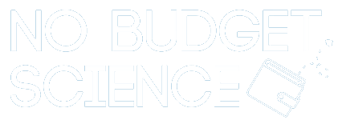

## No-Budget Science Hack Week 2019

### Projetos

Os quatro projetos desenvolvidos durante a semana tiveram diversos temas. Um dos grupos desenvolveu um projeto na plataforma [WikiData](wikidata.org/) para estruturação de dados de estudos clínicos, traduzindo uma [revisão sistemática do grupo Cochrane sobre cetamina e depressão](https://www.cochrane.org/CD011612/DEPRESSN_ketamine-and-other-glutamate-receptor-modulators-depression-adults) para o formato da WikiData. No processo, se depararam com questões filosóficas sobre o conhecimento científico e a ontologia da representação de dados de forma acessível por programas, fundamentais em tempos de produção de big data nas ciências biológicas.

Outro grupo se debruçou sobre as dificuldades que estudantes de ensino à distância enfrentam para se engajar na iniciação científica. Propuseram um [protótipo de plataforma](https://vinisalazar.github.io/nobudget-ead/) para facilitar o engajamento em projetos científicos à distância. Na proposta, apps de celular e um website fariam o intermédio com um orientador, para que os estudantes testem hipóteses com seus dados e ao mesmo tempo contribuam com a coleta de dados para um projeto maior, no modelo de ciência cidadã.

Um terceiro grupo colaborou com o [Instituto Serrapilheira](http://serrapilheira.org/) na análise de viés de gênero em diferentes etapas do processo seletivo dos seus editais de pesquisa. Além disso, exploraram a relação entre o sucesso das propostas submetidas e diferentes medidas quantitativas do conteúdo - palavras mais comuns, distância semântica entre propostas, tópicos abordados -, a fim de caracterizar os critérios de escolha que são efetivamente usados no processo de seleção do Instituto. Os resultados [tiveram impacto no processo de seleção seguinte](https://serrapilheira.org/por-que-ainda-temos-poucas-mulheres-entre-os-grantees-do-serrapilheira/).

A partir de um questionamento sobre as métricas normalmente usadas para avaliação de artigos e cientistas, o último grupo buscou criar um novo índice cientométrico que reflita transparência e rigor. Usando a plataforma [PEDro](https://www.pedro.org.au/), que contém avaliações de ensaios clínicos em fisioterapia, o grupo analisou artigos de vários pesquisadores, obtendo conclusões sobre o que um "índice de boa ciência" deve medir e sobre a viabilidade de obter os dados necessários em larga escala.

### Depoimentos

Nada melhor do que saber como foi a primeira edição do evento pelas palavras dos participantes: 

> "O aprendizado que tive durante a hack week com certeza abriu um mundo completamente diferente dentro da ciência do que eu estava acostumada até então. Eu não sei exatamente como isso vai afetar minha vida acadêmica no futuro, mas acredito que eu tenha sido privilegiada por ser apresentada a esse outro mundo e suas ferramentas, e tenha a oportunidade de utilizá-las."

> "Acredito que abriu diversas portas e janelas essa experiência, me tornou mais preocupada quanto à reprodutibilidade das minhas publicações, possibilitou aumentar minha rede de conhecimento de pesquisadores, pessoas que eu pretendo prosseguir em contato e realizando parcerias na pesquisa. Não conhecia tanto sobre a ciência aberta e diversas ferramentas abordadas. Isso me instigou a buscar conhecimento a respeito de algumas e quem sabe até aprender mais a respeito de programação."

> "Essa semana foi fundamental para desenvolver um novo olhar crítico para o desenvolvimento da ciência. Programas como esse ajudam a transparecer o cenário atual no qual estamos contidos e muita vezes nem percebemos."

> "Esse tipo de iniciativa me influenciou muito a conhecer e entender o que a comunidade cientifica se tornou. Sem dúvida está sendo muito positivo para mim e pretendo conseguir influenciar pessoas ao meu redor."